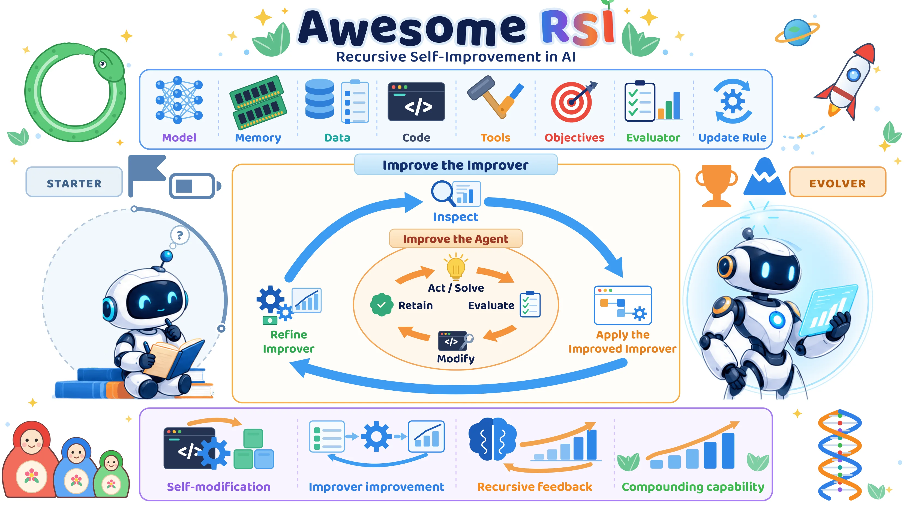

<div align="center">



# Awesome RSI [](https://awesome.re)

> Papers in which the loop that improves a system also changes the thing doing the improving.


[](LICENSE)
[](#contributing)

🧬 Rewrites its own code · ♻️ Optimizes its own optimizer · 🧩 Edits the harness that edits · 🌱 Searches its own designs · ♾️ Formal machines

</div>

---

## Contents

- [🔥 News](#-news)
- [🧬 Rewrites Its Own Code](#-rewrites-its-own-code) (10)
- [♻️ Optimizes Its Own Optimizer](#-optimizes-its-own-optimizer) (12)
- [🧩 Edits the Harness That Edits](#-edits-the-harness-that-edits) (4)
- [🌱 Searches Over Its Own Designs](#-searches-over-its-own-designs) (4)
- [♾️ Formal Self-Referential Machines](#-formal-self-referential-machines) (9)
- [🔗 Where the Rest of the Field Is](#-where-the-rest-of-the-field-is) (10)

---

## 🔥 News

🚀 **2026-09 · Repository launch.** PRs welcome.

---

## 🧬 Rewrites Its Own Code

The agent's working directory contains the agent, so an edit can land on the part that decides what to edit next.

- ⭐ [Darwin Godel Machine](https://arxiv.org/abs/2505.22954), "Open-Ended Evolution of Self-Improving Agents".  [](https://github.com/jennyzzt/dgm) [](https://huggingface.co/papers/2505.22954) [](https://sakana.ai/dgm/)
- ⭐ [Gödel Agent](https://arxiv.org/abs/2410.04444), "A Self-Referential Agent Framework for Recursive Self-Improvement".   [](https://github.com/Arvid-pku/Godel_Agent) [](https://huggingface.co/papers/2410.04444)
- ⭐ [A Self-Improving Coding Agent](https://arxiv.org/abs/2504.15228).  [](https://github.com/MaximeRobeyns/self_improving_coding_agent) [](https://huggingface.co/papers/2504.15228)
- [Hyperagents](https://arxiv.org/abs/2603.19461).  [](https://github.com/facebookresearch/HyperAgents) [](https://huggingface.co/papers/2603.19461)
- [Group-Evolving Agents](https://arxiv.org/abs/2602.04837), "Open-Ended Self-Improvement via Experience Sharing".  [](https://github.com/UCSB-AI/GEA) [](https://huggingface.co/papers/2602.04837)
- [Huxley-Gödel Machine](https://arxiv.org/abs/2510.21614), "Human-Level Coding Agent Development by an Approximation of the Optimal Self-Improving Machine".  [](https://github.com/metauto-ai/HGM) [](https://huggingface.co/papers/2510.21614)
- [Live-SWE-agent](https://arxiv.org/abs/2511.13646), "Can Software Engineering Agents Self-Evolve on the Fly?".  [](https://github.com/OpenAutoCoder/live-swe-agent) [](https://huggingface.co/papers/2511.13646)
- [MOSS](https://arxiv.org/abs/2605.22794), "Self-Evolution through Source-Level Rewriting in Autonomous Agent Systems".  [](https://github.com/hkgai-official/Moss) [](https://huggingface.co/papers/2605.22794)
- [Bounded Recursive Self-Improvement](https://arxiv.org/abs/1312.6764). 
- [Mendel Gödel Machine](https://arxiv.org/abs/2608.07645), "Recursive Self-Improving Coding Agents via Comparative Evolution".  [](https://huggingface.co/papers/2608.07645)

---

## ♻️ Optimizes Its Own Optimizer

The improvement is produced by a procedure, and that procedure is applied to itself.

- ⭐ [Self-Taught Optimizer (STOP)](https://arxiv.org/abs/2310.02304), "Recursively Self-Improving Code Generation".  [](https://github.com/microsoft/stop) [](https://huggingface.co/papers/2310.02304)
- ⭐ [Self-Adapting Language Models](https://arxiv.org/abs/2506.10943).  [](https://github.com/Continual-Intelligence/SEAL) [](https://huggingface.co/papers/2506.10943)
- ⭐ [Promptbreeder](https://arxiv.org/abs/2309.16797), "Self-Referential Self-Improvement Via Prompt Evolution".   [](https://huggingface.co/papers/2309.16797)
- [Meta^n](https://arxiv.org/abs/2608.24735), "Recursive Self-Improvement through Emergent Depth".  [](https://github.com/minnesotanlp/meta-n) [](https://huggingface.co/papers/2608.24735)
- [metaTextGrad](https://arxiv.org/abs/2505.18524), "Automatically optimizing language model optimizers".   [](https://github.com/zou-group/metatextgrad) [](https://huggingface.co/papers/2505.18524)
- [SePO](https://arxiv.org/abs/2606.04465), "Self-Evolving Prompt Agent for System Prompt Optimization".  [](https://github.com/taowangcheng/SePO) [](https://huggingface.co/papers/2606.04465)
- [MetaSkill-Evolve](https://arxiv.org/abs/2607.05297), "Recursive Self-Improvement of LLM Agents via Two-Timescale Meta-Skill Evolution".  [](https://huggingface.co/papers/2607.05297)
- [Learning to Evolve](https://arxiv.org/abs/2604.20714), "A Self-Improving Framework for Multi-Agent Systems via Textual Parameter Graph Optimization". 
- [Metalearning Continual Learning Algorithms](https://arxiv.org/abs/2312.00276).   [](https://huggingface.co/papers/2312.00276)
- [Arbitrary Order Meta-Learning with Simple Population-Based Evolution](https://arxiv.org/abs/2303.09478). 
- [Eliminating Meta Optimization Through Self-Referential Meta Learning](https://arxiv.org/abs/2212.14392). 
- [A Modern Self-Referential Weight Matrix That Learns to Modify Itself](https://arxiv.org/abs/2202.05780).   [](https://huggingface.co/papers/2202.05780)

---

## 🧩 Edits the Harness That Edits

The scaffold around the model is the substrate, and the component doing the scaffold editing is inside the substrate.

- [Ouroboros](https://arxiv.org/abs/2608.08311), "A Self-Developing Frontier Coding Agent with Reviewed Core Evolution".  [](https://github.com/razzant/ouroboros) [](https://huggingface.co/papers/2608.08311)
- [Continual Harness](https://arxiv.org/abs/2605.09998), "Online Adaptation for Self-Improving Foundation Agents".  [](https://github.com/sethkarten/continual-harness) [](https://huggingface.co/papers/2605.09998)
- [Self-Harness](https://arxiv.org/abs/2606.09498), "Harnesses That Improve Themselves".  [](https://huggingface.co/papers/2606.09498)
- [EvoTrainer](https://arxiv.org/abs/2606.03108), "Co-Evolving LLM Policies and Training Harnesses for Autonomous Agentic Reinforcement Learning".  [](https://huggingface.co/papers/2606.03108)

---

## 🌱 Searches Over Its Own Designs

A meta level writes candidate agents, operators or memory architectures as code, then searches the archive it just extended.

- ⭐ [Automated Design of Agentic Systems](https://arxiv.org/abs/2408.08435).  [](https://github.com/ShengranHu/ADAS) [](https://huggingface.co/papers/2408.08435)
- [The Red Queen Gödel Machine](https://arxiv.org/abs/2606.26294), "Co-Evolving Agents and Their Evaluators".  [](https://huggingface.co/papers/2606.26294)
- [Learning to Continually Learn via Meta-learning Agentic Memory Designs](https://arxiv.org/abs/2602.07755).  [](https://github.com/zksha/alma) [](https://huggingface.co/papers/2602.07755)
- [AlgoEvolve](https://arxiv.org/abs/2606.26173), "LLM-driven Meta-evolution of Algorithmic Trading Programs". 

---

## ♾️ Formal Self-Referential Machines

Machines and theorems, where the question was first posed: what self-modification can be proved to buy, and at what cost.

- ⭐ [Godel Machines](https://arxiv.org/abs/cs/0309048), "Self-Referential Universal Problem Solvers Making Provably Optimal Self-Improvements". 
- [From Seed AI to Technological Singularity via Recursively Self-Improving Software](https://arxiv.org/abs/1502.06512). 
- [Self-Reference in Large Language Models: The Introspection Threshold for Recursive Self-Improvement](https://arxiv.org/abs/2607.04277). 
- [Performance of Bounded-Rational Agents With the Ability to Self-Modify](https://arxiv.org/abs/2011.06275).  
- [A Formulation of Recursive Self-Improvement and Its Possible Efficiency](https://arxiv.org/abs/1805.06610). 
- [Self-Modification of Policy and Utility Function in Rational Agents](https://arxiv.org/abs/1605.03142). 
- [The Unverifiability of Artificial General Intelligence (AGI) Alignment, Static and Dynamic: From Trakhtenbrot's Wall to the Safety-Generality Tension](https://arxiv.org/abs/2606.28639). 
- [What does a system modify when it modifies itself?](https://arxiv.org/abs/2603.27611). 
- [SGM](https://arxiv.org/abs/2510.10232), "A Statistical Godel Machine for Risk-Controlled Recursive Self-Modification". 

---

## 🔗 Where the Rest of the Field Is

Self-improving and self-evolving agents, prompt optimization, memory and skill libraries, benchmarks and safety work are all out of scope here. These lists cover them.

- [Awesome AI Scientist](https://github.com/Omni-Scientist/Awesome-AI-Scientist), Sibling list, for AI systems that do science rather than improve themselves. [](https://github.com/Omni-Scientist/Awesome-AI-Scientist)
- [awesome-rsi (lobehub)](https://github.com/lobehub/awesome-rsi), Research map of RSI organized by model level, harness level and automated AI R&D. [](https://github.com/lobehub/awesome-rsi)
- [awesome-rsi (pinkbubblebubble)](https://github.com/pinkbubblebubble/awesome-rsi), Evidence-labelled collection with an explicit inclusion decision procedure. [](https://github.com/pinkbubblebubble/awesome-rsi)
- [Awesome-Self-Evolving-Agents](https://github.com/XMUDeepLIT/Awesome-Self-Evolving-Agents), Companion list to the what, when, how and where to evolve survey. [](https://github.com/XMUDeepLIT/Awesome-Self-Evolving-Agents)
- [Awesome-Self-Improving-Agents](https://github.com/selfimproving-agent/awesome-Self-Improving-Agents), Reading list for self-improvement in foundation-model agentic systems. [](https://github.com/selfimproving-agent/awesome-Self-Improving-Agents)
- [Awesome-Harness-Self-Improvement](https://github.com/leezythu/Awesome-Harness-Self-Improvement), Focused on the harness layer, bilingual, with an explicit optimization ladder. [](https://github.com/leezythu/Awesome-Harness-Self-Improvement)
- [awesome-recursive-self-improving-agents](https://github.com/D2I-ai/awesome-recursive-self-improving-agents), Living index for the foundation, framework and future directions survey. [](https://github.com/D2I-ai/awesome-recursive-self-improving-agents)
- [Awesome-Agent-Harness](https://github.com/Gloriaameng/Awesome-Agent-Harness), Survey-backed list of agent harness designs. [](https://github.com/Gloriaameng/Awesome-Agent-Harness)
- [awesome-automl-papers](https://github.com/hibayesian/awesome-automl-papers), The pre-LLM automated machine learning literature this field grew out of. [](https://github.com/hibayesian/awesome-automl-papers)
- [Awesome-RL-for-LRMs](https://github.com/TsinghuaC3I/Awesome-RL-for-LRMs), Reinforcement learning for large reasoning models, the training half of the weight-level loop. [](https://github.com/TsinghuaC3I/Awesome-RL-for-LRMs)

---

## Contributing

Open a pull request. Link the paper, add the code repository if there is one, and say in one line which component of the system the improvement loop modifies. See [CONTRIBUTING.md](CONTRIBUTING.md) for the entry format.

---

## Footnotes

```bibtex
@misc{awesome_rsi,
  title        = {Awesome RSI},
  year         = {2026},
  howpublished = {\url{https://github.com/Omni-Scientist/Awesome-RSI}},
  note         = {Papers in which the improvement loop modifies its own machinery}
}
```
